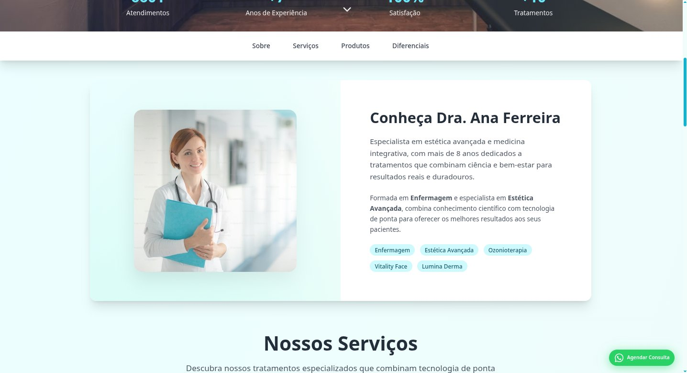
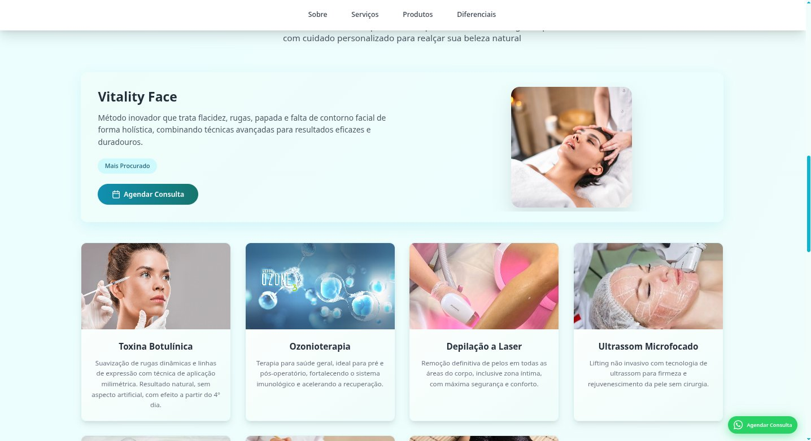
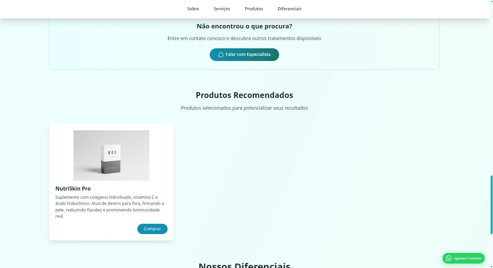

# Clínica Exemplo — Site Institucional

Site institucional para clínica de estética e saúde. Projeto de portfólio com dados fictícios.

## 🔗 Demo

**[mathias-ctrl.github.io/clinica-exemplo](https://mathias-ctrl.github.io/clinica-exemplo)**

---

## 📸 Screenshots

### Hero


### Sobre a Profissional


### Serviços


### Produtos


---

## 🛠 Tecnologias

- HTML5 semântico
- CSS3 customizado
- JavaScript vanilla
- [Tailwind CSS](https://tailwindcss.com/) via CDN
- [Lucide Icons](https://lucide.dev/) via CDN

---

## ✨ Funcionalidades

- Layout responsivo (mobile-first)
- Animações de entrada com IntersectionObserver
- Contadores numéricos animados
- Botão flutuante de WhatsApp
- Smooth scroll na navegação
- Efeito hover nos cards de serviços
- Card de destaque para serviço principal

---

## 📁 Estrutura

```
clinica-exemplo/
├── index.html
├── css/
│   └── styles.css
├── js/
│   └── main.js
├── img/
│   └── (imagens dos serviços)
└── screenshots/
    └── (prints do projeto)
```

---

## 📄 Licença

MIT © [Mathias Arruda](https://github.com/mathias-ctrl)
